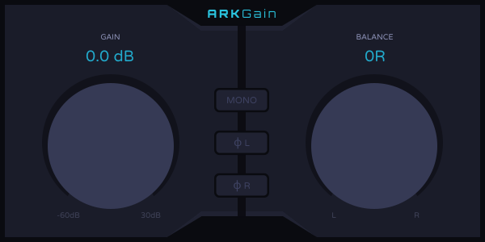

# ARKGain

**ARKGain** is a simple, practically useless gain plugin. It was developed solely as a learning project for the VST3
SDK and using a more modern GUI rendering solution instead of Steinberg's VSTGUI. The renderer is vector-based and takes
SVG files with metadata tags as input for displaying and operating the interface and uses OpenGL to handle the actual
rendering.

> The last sentence was a lie. I haven't written the SVG part yet, but if I say it then I have to.

## Class Descriptions

### CIDs

Controller and processor UUIDs. This file will never be touched.

*Required by the VST3 SDK and generated automatically when using Steinberg's project
creator.*

### Controller

Handles plugin state. Parameters and editor views are managed here.

*Required by the VST3 SDK and generated
automatically when using Steinberg's project
creator.*

### Factory

Handles the actual creation of the plugin, and where you set plugin metadata like the name, version, and company that
developed it.

*Required by the VST3 SDK and generated
automatically when using Steinberg's project
creator.*

### GraphicsContext

Manages the OpenGL context used for rendering.

### ParameterIds

ID values for plugin parameters, used by both the controller and processor.

### Platform

Platform-specific `includes` and cross-platform helper utilities.

### Processor

This is where the actual audio data gets processed.

*Required by the VST3 SDK and generated
automatically when using Steinberg's project
creator.*

### View

Extends `Steinberg::EditorView` in order to create a custom rendering context. VSTGUI implements the same interface
for its UI solution. `Steinberg::EditorView` extends `Steinberg::IPlugView` which is the root interface all editor
interfaces must implement and handles window creation, shutdown, and system events like key and mouse presses.

### Win32Window

Namespace that manages a Win32 window.